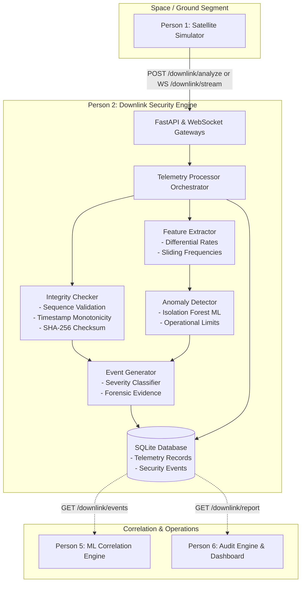

# ORBITAL SHIELD — Module 1: Downlink Security Engine (Person 2)

[](https://www.python.org/)
[](https://fastapi.tiangolo.com/)
[](https://scikit-learn.org/)
[]()

Production-grade cybersecurity microservice responsible for real-time satellite telemetry integrity verification and Machine Learning behavioral anomaly detection for simulated Low Earth Orbit (LEO) Earth Observation missions (`SAT-EO-01`).

---

## Table of Contents

1. [System Architecture](#1-system-architecture)
2. [Dual-Engine Security Design](#2-dual-engine-security-design)
3. [Project Structure](#3-project-structure)
4. [Installation & Setup](#4-installation--setup)
5. [Model Training & Baseline](#5-model-training--baseline)
6. [Starting the Application](#6-starting-the-application)
7. [API Endpoints & Documentation](#7-api-endpoints--documentation)
8. [Telemetry Input Contract](#8-telemetry-input-contract)
9. [Shared SecurityEvent Schema](#9-shared-securityevent-schema)
10. [Running Attack Simulations & Demos](#10-running-attack-simulations--demos)
11. [Running the Test Suite](#11-running-the-test-suite)
12. [Integration Guide for Teammates](#12-integration-guide-for-teammates)
    - [Person 1: Satellite Simulator Integration](#person-1-satellite-simulator-integration)
    - [Person 5: ML Correlation Engine Integration](#person-5-ml-correlation-engine-integration)
    - [Person 6: Audit & Dashboard Integration](#person-6-audit--dashboard-integration)

---

## 1. System Architecture

In the six-person **ORBITAL SHIELD** platform, the **Downlink Security Engine (Person 2)** sits directly behind the Ground Station Gateway / Satellite Simulator (Person 1), acting as the first line of defense to verify telemetry authenticity and operational behavior before passing standardized `SecurityEvent`s to the ML Correlation Engine (Person 5) and Audit/Dashboard (Person 6).



---

## 2. Dual-Engine Security Design

The Downlink Security Engine rigorously decouples **Integrity Verification** from **Behavioral Anomaly Detection**:

```text
Incoming Telemetry Packet
           │
     ┌─────┴─────────────────────┐
     ▼                           ▼
[Integrity Checker]      [Behavioral Detector]
(Deterministic Checks)   (Isolation Forest ML)
  - Sequence jump          - Multi-variate model
  - Replay / Duplicate     - Thermal spike / drop
  - Out-of-order packet    - RF attenuation / drop
  - Future timestamp       - Telemetry burst floods
  - SHA-256 checksum       - Rate-of-change delta
     │                           │
     └─────────────┬─────────────┘
                   ▼
       [SecurityEvent Synthesis]
     (Action: REVIEW or ALERT)
```

1. **Deterministic Integrity Verification**:
   - **Sequence Validation**: Detects packet drops, out-of-order delivery, and replayed packets.
   - **Timestamp Validation**: Validates ISO-8601 UTC format, clock drift tolerance (default 30s), expiration, and non-retrograde progression.
   - **Cryptographic Hash Validation**: Verifies canonical SHA-256 payload checksums.
   - **Signature Handling**: Captures digital signatures cleanly without fake verification.
2. **Behavioral Anomaly Detection (Isolation Forest)**:
   - Evaluates multi-dimensional behavioral features against the `SAT-EO-01` baseline.
   - Computes calibrated anomaly scores, normalized confidence [0.0 - 1.0], severity tiers (`NORMAL`, `LOW`, `MEDIUM`, `HIGH`, `CRITICAL`), and explainable diagnostic reasons.
   - Defaults action recommendations to `REVIEW` (or `ALERT` on integrity tampering), preventing automated, unauthorized spacecraft commands.

---

## 3. Project Structure

```text
downlink-engine/
│
├── app/
│   ├── __init__.py
│   ├── main.py                     # FastAPI application & lifecycle
│   │
│   ├── api/
│   │   ├── __init__.py
│   │   ├── routes_downlink.py      # /downlink/analyze, /events, /report, /status, /stream
│   │   └── routes_health.py        # /health
│   │
│   ├── core/
│   │   ├── __init__.py
│   │   ├── config.py               # Settings & .env loading
│   │   └── logging_config.py       # Structured logging
│   │
│   ├── models/
│   │   ├── __init__.py
│   │   ├── telemetry.py            # SQLAlchemy TelemetryRecord
│   │   └── security_event.py       # SQLAlchemy SecurityEventRecord
│   │
│   ├── schemas/
│   │   ├── __init__.py
│   │   ├── telemetry.py            # Pydantic TelemetryInput & AnalysisResponse
│   │   └── security_event.py       # Shared project-wide SecurityEvent schema
│   │
│   ├── services/
│   │   ├── __init__.py
│   │   ├── anomaly_detector.py     # Isolation Forest & diagnostic reason engine
│   │   ├── integrity_checker.py    # Sequence, timestamp & SHA-256 checker
│   │   ├── feature_extractor.py    # Statistical & differential feature pipeline
│   │   ├── telemetry_processor.py  # Orchestration & event synthesizer
│   │   └── report_generator.py     # Daily summary & recommendations
│   │
│   ├── db/
│   │   ├── __init__.py
│   │   ├── database.py             # SQLite engine & session management
│   │   └── repository.py           # CRUD & aggregation queries
│   │
│   └── utils/
│       ├── __init__.py
│       └── hashing.py              # Canonical SHA-256 hashing
│
├── data/
│   ├── baseline/
│   │   └── sample_normal_telemetry.csv  # 10,000 baseline telemetry samples
│   └── test/
│       ├── normal_telemetry.json
│       ├── anomalous_telemetry.json
│       └── tampered_telemetry.json
│
├── models/
│   └── isolation_forest.joblib     # Pre-trained ML artifact
│
├── tests/
│   ├── __init__.py
│   ├── conftest.py                 # Pytest fixtures & in-memory test DB
│   ├── test_integrity.py           # 9 integrity test cases
│   ├── test_feature_extraction.py  # 4 feature pipeline test cases
│   ├── test_anomaly_detection.py   # 5 ML anomaly detection test cases
│   ├── test_security_event.py      # 3 shared event schema test cases
│   └── test_api.py                 # 8 REST & WebSocket integration tests
│
├── scripts/
│   ├── train_model.py              # Baseline dataset generator & model trainer
│   └── generate_test_data.py       # Attack generator & live CLI demo runner
│
├── requirements.txt
├── .env.example
├── .gitignore
├── README.md
└── run.py
```

---

## 4. Installation & Setup

### Prerequisites
- Python 3.11+
- Git

### 1. Clone & Enter Directory
```bash
git clone <repository-url>
cd downlink-engine
```

### 2. Create Virtual Environment
```bash
# Windows
python -m venv venv
venv\Scripts\activate

# Linux / macOS
python3 -m venv venv
source venv/bin/activate
```

### 3. Install Dependencies
```bash
python -m pip install -r requirements.txt
```

### 4. Configuration (.env)
Copy `.env.example` to `.env`:
```bash
cp .env.example .env
```
Default configuration parameters:
```ini
DATABASE_URL=sqlite:///./downlink.db
MODEL_PATH=models/isolation_forest.joblib
BASELINE_DATA_PATH=data/baseline/sample_normal_telemetry.csv
SATELLITE_ID=SAT-EO-01
TIMESTAMP_TOLERANCE_SECONDS=30.0
ANOMALY_THRESHOLD=0.0
HIGH_SEVERITY_THRESHOLD=-0.15
CRITICAL_SEVERITY_THRESHOLD=-0.30
HOST=0.0.0.0
PORT=8000
LOG_LEVEL=INFO
```

---

## 5. Model Training & Baseline

Train the Isolation Forest model on the mission baseline (`SAT-EO-01`):
```bash
python scripts/train_model.py
```
**Output**:
- Synthesizes `data/baseline/sample_normal_telemetry.csv` (10,000 nominal LEO samples).
- Fits `IsolationForest(n_estimators=100, contamination=0.01)`.
- Exports trained model artifact to `models/isolation_forest.joblib`.

---

## 6. Starting the Application

Launch the FastAPI server:
```bash
python run.py
```
Or via uvicorn directly:
```bash
python -m uvicorn app.main:app --host 0.0.0.0 --port 8000 --reload
```

Interactive API documentation will be available at:
- **Swagger UI**: `http://127.0.0.1:8000/docs`
- **ReDoc UI**: `http://127.0.0.1:8000/redoc`

---

## 7. API Endpoints & Documentation

| Method | Endpoint | Description |
|---|---|---|
| `GET` | `/health` | System health, ML model loading status, DB status |
| `POST` | `/downlink/analyze` | Ingest and evaluate single telemetry packet |
| `GET` | `/downlink/events` | Query stored `SecurityEvent`s with filtering |
| `GET` | `/downlink/report` | Generate daily telemetry summary & recommendations |
| `GET` | `/downlink/status` | Engine operational sequence & packet statistics |
| `WS` | `/downlink/stream` | Real-time continuous WebSocket telemetry streaming |

---

## 8. Telemetry Input Contract

### Request: `POST /downlink/analyze`

```json
{
    "timestamp": "2026-08-25T02:14:30Z",
    "satellite_id": "SAT-EO-01",
    "sequence_number": 1001,
    "temperature": 24.5,
    "battery": 87.2,
    "signal_strength": -71.3,
    "latitude": 11.0168,
    "longitude": 76.9558,
    "packet_hash": "optional_sha256_hash",
    "signature": "optional_signature"
}
```

### Example Curl:
```bash
curl -X POST "http://127.0.0.1:8000/downlink/analyze" \
  -H "Content-Type: application/json" \
  -d '{
    "timestamp": "2026-08-25T02:14:30Z",
    "satellite_id": "SAT-EO-01",
    "sequence_number": 1001,
    "temperature": 24.5,
    "battery": 87.2,
    "signal_strength": -71.3,
    "latitude": 11.0168,
    "longitude": 76.9558
  }'
```

### Response (Nominal Telemetry):
```json
{
  "status": "PROCESSED",
  "telemetry": {
    "timestamp": "2026-08-25T02:14:30Z",
    "satellite_id": "SAT-EO-01",
    "sequence_number": 1001,
    "temperature": 24.5,
    "battery": 87.2,
    "signal_strength": -71.3,
    "latitude": 11.0168,
    "longitude": 76.9558,
    "packet_hash": null,
    "signature": null
  },
  "integrity": {
    "sequence_valid": true,
    "timestamp_valid": true,
    "hash_valid": true,
    "signature_status": "NOT_PROVIDED",
    "integrity_status": "VALID",
    "integrity_issues": []
  },
  "anomaly": {
    "is_anomaly": false,
    "anomaly_score": 0.2104,
    "confidence": 0.985,
    "severity": "NORMAL",
    "reason": "Telemetry parameters conform to baseline nominal operational profile."
  },
  "security_event": null
}
```

---

## 9. Shared SecurityEvent Schema

When an anomaly or integrity violation is detected, a standardized `SecurityEvent` is generated:

```json
{
  "event_id": "EVT-DL-000001",
  "timestamp": "2026-08-25T02:14:30Z",
  "source": "DOWNLINK",
  "satellite_id": "SAT-EO-01",
  "event_type": "TELEMETRY_ANOMALY",
  "severity": "HIGH",
  "confidence": 0.935,
  "description": "Thermal spike detected: temperature 82.5°C exceeds nominal ceiling 32.0°C",
  "action": "REVIEW",
  "evidence": {
    "satellite_id": "SAT-EO-01",
    "sequence_number": 1002,
    "expected_sequence_number": 1002,
    "temperature": 82.5,
    "expected_temperature_range": [15.0, 32.0],
    "battery": 87.2,
    "signal_strength": -71.3,
    "packet_frequency": 10.0,
    "anomaly_score": -0.258,
    "integrity_status": "VALID",
    "integrity_issues": [],
    "signature_status": "NOT_PROVIDED"
  },
  "related_events": []
}
```

### Supported Event Types:
- `TELEMETRY_ANOMALY`
- `TELEMETRY_INTEGRITY_FAILURE`
- `SEQUENCE_ANOMALY`
- `TIMESTAMP_ANOMALY`
- `PACKET_HASH_MISMATCH`
- `TELEMETRY_REPLAY`
- `TELEMETRY_SPOOFING`

---

## 10. Running Attack Simulations & Demos

Generate all attack test JSON files (`data/test/`):
```bash
python scripts/generate_test_data.py --export
```

Run the live interactive demonstration against a running server:
```bash
python scripts/generate_test_data.py --demo
```

### Demonstration Scenarios Covered:
1. **Normal Telemetry Scenario**:
   - `Integrity: VALID` | `Anomaly: False` | `No SecurityEvent emitted`
2. **Thermal Spike / Spoofing Scenario**:
   - Temperature jumps from 24.2°C to 82.5°C
   - `Anomaly: True` | `Severity: HIGH` | `Event: TELEMETRY_SPOOFING` | `Action: REVIEW`
3. **Packet Tampering Scenario**:
   - Modifies payload data without recalculating original SHA-256 + sequence jump
   - `Integrity: INVALID` | `Severity: CRITICAL` | `Event: TELEMETRY_INTEGRITY_FAILURE` | `Action: ALERT`

---

## 11. Running the Test Suite

Run the full pytest suite covering unit, ML, and integration tests:
```bash
python -m pytest tests/ -v
```

Test coverage includes:
- **`tests/test_integrity.py`**: Sequence validation (normal, jump, duplicate, out-of-order), timestamp drift/expiration/monotonicity, SHA-256 hash matching/mismatches.
- **`tests/test_feature_extraction.py`**: Initial packet baseline defaults, rates of change ($\Delta T, \Delta B, \Delta S$), frequency metrics, batch matrix extraction.
- **`tests/test_anomaly_detection.py`**: Model loading, nominal telemetry, thermal spike detection, RF attenuation, telemetry burst flooding.
- **`tests/test_security_event.py`**: Schema adherence, source tagging (`DOWNLINK`), event ID formatting (`EVT-DL-XXXXXX`), action restrictions (`REVIEW`/`ALERT`).
- **`tests/test_api.py`**: `/health`, `/downlink/analyze`, `/downlink/events`, `/downlink/report`, `/downlink/status`, 422 validation, `/downlink/stream` WebSocket.

---

## 12. Integration Guide for Teammates

### Person 1: Satellite Simulator Integration

**Option A: HTTP REST**
Send each telemetry packet via `POST /downlink/analyze`:
```python
import requests

telemetry = {
    "timestamp": "2026-08-25T02:14:30Z",
    "satellite_id": "SAT-EO-01",
    "sequence_number": 1001,
    "temperature": 24.5,
    "battery": 87.2,
    "signal_strength": -71.3,
    "latitude": 11.0168,
    "longitude": 76.9558
}

response = requests.post("http://<person2-ip>:8000/downlink/analyze", json=telemetry)
result = response.json()
```

**Option B: WebSocket Streaming**
Connect to `ws://<person2-ip>:8000/downlink/stream` to stream packets and receive real-time analysis responses.

---

### Person 5: ML Correlation Engine Integration

Query standardized `SecurityEvent`s produced by Person 2:
```python
import requests

# Retrieve HIGH and CRITICAL events from the Downlink Engine
response = requests.get(
    "http://<person2-ip>:8000/downlink/events",
    params={"satellite_id": "SAT-EO-01", "severity": "HIGH"}
)
events = response.json()

for event in events:
    print(f"Event {event['event_id']}: {event['event_type']} - {event['description']}")
    print(f"Forensic Evidence: {event['evidence']}")
```

---

### Person 6: Audit & Dashboard Integration

Fetch the aggregated daily report summary:
```python
import requests

response = requests.get("http://<person2-ip>:8000/downlink/report?satellite_id=SAT-EO-01")
report = response.json()

print(f"Total Packets: {report['total_telemetry_packets']}")
print(f"Integrity Failures: {report['integrity_failures']}")
print(f"Behavioral Anomalies: {report['anomalous_packets']}")
print(f"Recommendations: {report['recommendations']}")
```
